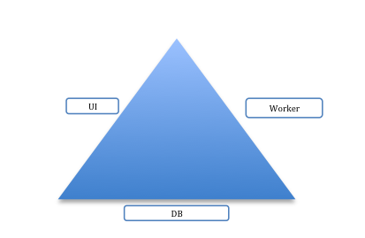
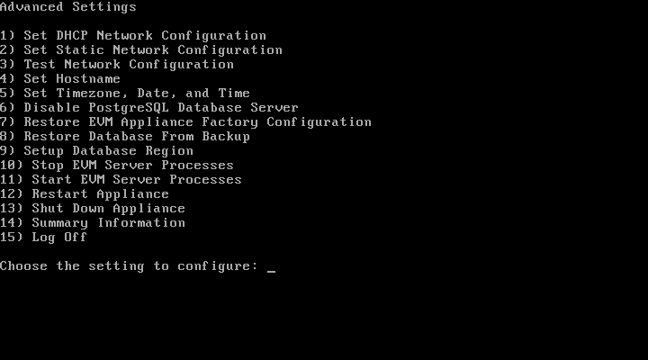

= YaleNUS Cloudforms Environment

== Overview
TODO

=== Pre-requisites
* Web Browsers: 
** Mozilla Firefox for versions supported under Mozilla's Extended Support Release (ESR)
** Internet Explorer 8 or Higher
* Adobe Flash Player 9 or above. 
* The Cloudforms Management Engine Appliance must already be installed and activated in your enterprise.
* The SmartProxy must have visibility to the virtual machines and cloud instances that you want to control.
* Server Racked, Stacked and Cabled
* Switch configuration completed

=== Versions
[width="100%"]
|====
| OS Version | RHEL 6.6 x86_64
| Cloudforms Version | Cloudforms 3.1
|====

=== Architecture

At YaleNUS we had some discussions around the size of the environment.  Some of the questions that were asked were: 

* How many VMs will be managed in your virtualization environment?
* Do you have provisioning templates in place?
* Do you have multiple data centers that need to be managed?
* Do you have a local NTP server?
* Do you have a local DNS or remote DNS service?
* Are forward and reverse DNS resolution configured in your environment?
* Is there at least 42 GB disk space on target virtualization platform?

At Yale NUS the objective of the engagement was to integrate the new Red Hat OpenStack environment and Microsoft AD 
environment where they housed their users. Yale NUS would like to implement a Self-service provisioning system using 
Cloudforms as the front end where professors and students would only see the VM's that they owned.

Yale uses Microsoft Active Directory (AD) as their directory service implementation. An AD domain controller 
authenticates and authorizes Yale NUS users assigning and enforcing security policies. The VMs are used by student, 
faculty and other users as well as by the operations group. 

This information gave us a general idea of the size of the environment and allowed us to figure out how to size 
the Cloudforms database adequately the first time around. The new appliance does not include the database disk 
so with the database appliance we are required to create a separate database disk that would be used by the 
Database Appliance.

In addition, we briefly discussed the overall Cloudforms architecture which included discussions on Zones and 
the roles of each appliance.  

There are three main roles for an appliance:
* UI Appliance – allows the user to interact with the Cloudforms user interface
* Worker Appliance – The workhorse which collects all the information from the virtualization environment and sends it to the database to be persisted.
* Database Appliance – one of the most important appliances since it holds all of the data collected by the workers from the virtualization environment.

It is considered a best practice to separate the appliance responsibilities into these three roles.  Each appliance can be configured with the appropriate roles and tuned to be more performant in the overall environment. 

The Basic Architecture for Cloudforms can be described in a simple Triangle:

The diagram not only depicts the three main roles for the appliances but also the zones that should be created 
to house each type of appliance.  It is best practice to create three zones in a Cloudforms environment: 

* UI Zone
* Database Zone 
* Worker Zone. 

If we were to draw a box around the triangle this would define a Region.  

A region should have a Database Zone with only one Database Appliance to house all the virtual environment 
information. If there are multiple data centers, in different geographic locations, you would replicate the
architecture at each data center. The database appliances can be configured to include the Synchronization 
server role to replicate its contents to a main database. Best practice states that you should only 
have one database appliance handling the data for one data center.  

The current implementation for YaleNUS only has one appliance but this can easily be extended in future phases 
of the project.

== Initial Cloudforms Engine Setup

To manage a ~1500 virtual machines workload in a virtualization environment, multiple appliances should be created
and the roles distributed for better performance and redundancy: 1 DB, 2 Web UI and 4 Workers. Red Hat recommends 
5 Workers in the scenario of ~1500 virtual machines, to maintain a 300:1 VM to appliance ratio. 

To increase performance, increase the default 4 vCPUs/6GB RAM appliance configuration to 4 vCPUs/8GB RAM for the 
Web UI appliance and 4 vCPUs/8GB RAM for the DB and the Worker appliances.

With a new CFME appliance the Database is not shipped configured by default. There will need to be a separate 
Database disk created outside of the appliance and then connected once the appliance has been started. In this case,
after looking at where the current VM count and number of VM's that will be coming over the next few years the 
Database can be sized to 150GB. This will allow for growth over the next few years.
 
Once started, the appliances need to be configured with basic network settings using the a console in 
the OpenStack client. Login as admin/smartvm and press Enter to go to the Advanced Settings menu.  Set Static 
Network Configuration, Set Hostname, Set Timezone, Date, and Time. When done entering the settings, select 
Summary Information to review. 

>>>>>>> master

[width="100%"]
|====
| RAM | 4 GB
|====

** Detailed Hardware Specs per Hypervisor:
----

----

=== Networks Information

[width="100%",options="header"]
|====
| Name | VM? | On hosts | Special attributes | Notes
| CFME Engine | Y |  | | The default CFME Engine
| 
|====

